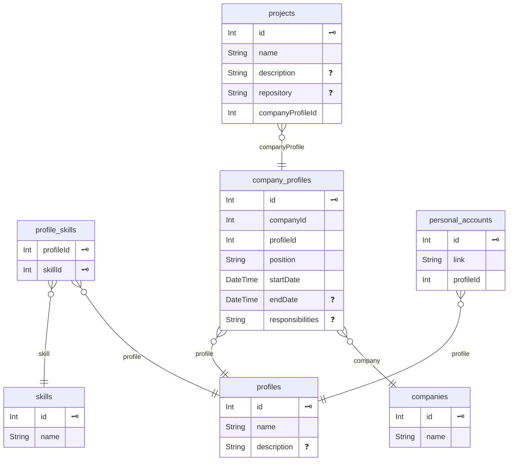

```mermaid
erDiagram

  "profiles" {
    Int id "🗝️"
    String name 
    String description "❓"
    }
  

  "skills" {
    Int id "🗝️"
    String name 
    }
  

  "profile_skills" {
    Int profileId "🗝️"
    Int skillId "🗝️"
    }
  

  "companies" {
    Int id "🗝️"
    String name 
    }
  

  "company_profiles" {
    Int id "🗝️"
    Int companyId 
    Int profileId 
    String position 
    DateTime startDate 
    DateTime endDate "❓"
    String responsibilities "❓"
    }
  

  "projects" {
    Int id "🗝️"
    String name 
    String description "❓"
    String repository "❓"
    Int companyProfileId 
    }
  

  "personal_accounts" {
    Int id "🗝️"
    String link 
    Int profileId 
    }
  
    "profile_skills" }o--|| "profiles" : "profile"
    "profile_skills" }o--|| "skills" : "skill"
    "company_profiles" }o--|| "companies" : "company"
    "company_profiles" }o--|| "profiles" : "profile"
    "projects" }o--|| "company_profiles" : "companyProfile"
    "personal_accounts" }o--|| "profiles" : "profile"
```
